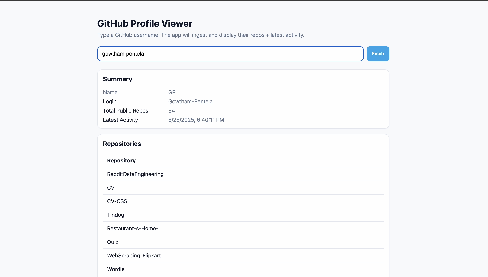

# GitHub Profile Data Pipeline on AWS

This project is an **end-to-end AWS serverless data pipeline and web application**.  
It fetches GitHub user data (profile, repositories, and recent activity), stores it in AWS, and serves it through an API and a simple web UI.

---

## 🚀 Project Overview

- **Input**: A GitHub username (e.g. `torvalds`, `Gowtham-Pentela`).  
- **Processing**:  
  - Ingest request → SQS → Lambda worker → GitHub API → S3 + DynamoDB.  
- **Storage**:  
  - **S3** stores raw snapshots (`profile`, `repos`, `events`) in partitioned ndjson.gz.  
  - **DynamoDB** stores structured profile + repo + activity data.  
- **Serving**:  
  - **API Gateway** provides two endpoints:  
    - `POST /ingest` → enqueue a fetch job  
    - `GET /profile/{username}` → fetch structured profile details  
  - **Static Web UI** (S3/CloudFront hosted) lets end users type a username and view the results.

---

## 🏗️ Architecture

```text
          +-------------+
          |   Browser   |
          | (index.html)|
          +------+------+
                 |
                 v
        +--------+---------+
        |  API Gateway     |
        +---+----------+---+
            |          |
            v          v
    POST /ingest   GET /profile/{username}
            |          |
            v          |
   +--------+---+      |
   | StartIngestFn|     |
   +--------+-----+     |
            |           |
            v           |
       +----+----+      |
       |   SQS    |     |
       | IngestQ  |     |
       +----+-----+     |
            |           |
            v           |
     +------+------+
     | FetchGithub |
     |   UserFn    |
     +------+------+
            |
     +------+---------------------------+
     |                                  |
     v                                  v
+----+----+                       +-----+------+
|   S3     |  Raw snapshots       | DynamoDB   |
| gh-raw-* |<---------------------|  UserTable |
+----+----+                       +-----+------+
                                       |
                                       v
                              +--------+---------+
                              |   GetProfileFn   |
                              +------------------+
````

---

## ⚙️ AWS Services Used

* **API Gateway** – REST API endpoints
* **Lambda** – serverless functions (`StartIngestFn`, `FetchGithubUserFn`, `GetProfileFn`)
* **SQS** – decouples ingest requests
* **S3** – raw storage for fetched GitHub JSON
* **DynamoDB** – structured storage for querying profile/repos/events
* **Secrets Manager** – stores GitHub API token securely
* **CloudWatch** – logs and monitoring

---

## 🛠️ Setup Instructions

### 1. Prerequisites

* AWS account (us-east-2 in this setup)
* GitHub **Personal Access Token** (PAT)

### 2. Store GitHub Token

* AWS Console → **Secrets Manager** → Create Secret → type: *Other type of secret*
* Key/value JSON:

  ```json
  { "token": "ghp_xxxYOURTOKENxxx" }
  ```
* Save as `github/pat` and copy ARN.

### 3. Create Resources

* **S3 Bucket**: `gh-raw-gowtham-001`
* **DynamoDB Table**: `UserTable`

  * PK: `PK` (string)
  * SK: `SK` (string)
* **SQS Queues**: `IngestQueue`, `IngestDLQ`

### 4. Deploy Lambdas

* `StartIngestFn` → enqueue jobs to SQS
* `FetchGithubUserFn` → poll SQS, fetch GitHub API, write to S3 + DynamoDB
* `GetProfileFn` → read from DynamoDB, return structured JSON
* Set environment variables:

  * `QUEUE_URL`, `BUCKET_NAME`, `TABLE_NAME`, `GITHUB_SECRET_NAME`

### 5. Create API Gateway

* REST API: `gh-pipeline-api`
* Resources:

  * `POST /ingest` → `StartIngestFn` (Lambda proxy enabled)
  * `GET /profile/{username}` → `GetProfileFn` (Lambda proxy enabled)
* Enable **CORS** for both methods
* Deploy to stage: `prod`

### 6. Deploy Frontend UI

* Create new S3 bucket: `gh-ui-gowtham-001`
* Enable **Static Website Hosting** → index document: `index.html`
* Upload the provided `index.html` (with your `API_BASE` set to your API URL).
* Apply a bucket policy for public read.

---

## 📦 How to Use

### API (manual testing)

```bash
# Enqueue an ingest
curl -X POST -H "Content-Type: application/json" \
  -d '{"username":"torvalds","max_items":200}' \
  https://<api-id>.execute-api.us-east-2.amazonaws.com/prod/ingest

# Fetch profile
curl https://<api-id>.execute-api.us-east-2.amazonaws.com/prod/profile/torvalds
```

### UI (end users)

1. Open your S3 static website endpoint (or CloudFront URL).
2. Enter a GitHub username (e.g., `torvalds`, `Gowtham-Pentela`).
3. The UI will:

   * Trigger ingest (if not already present)
   * Poll until data is ready
   * Show:

     * Profile summary
     * Total repository count
     * Table of repositories
     * Latest Git activity

---

## 📽️ Results

- The system successfully ingests GitHub user data, stores it in S3 + DynamoDB, and serves it via API Gateway.  
- The UI allows entering any username and displays:
  - Profile summary
  - Repository list in tabular format
  - Latest GitHub activity  

🎥 **Demo:**  
[](results/demo.mp4)


---

## 🛡️ Next Steps & Enhancements

* Add **EventBridge** scheduler to refresh nightly.
* Add **CloudWatch alarms** (Lambda errors, SQS DLQ messages).
* Add **S3 lifecycle policy** (expire raw data after 30–60 days).
* Add **token rotation** policy in Secrets Manager.
* Add **CloudFront** in front of S3 for HTTPS and caching.
* Extend UI: clickable repo links, spinner, charts (stars/languages).

---

## 👨‍💻 Author

Built by **[Gowtham-Pentela](https://github.com/Gowtham-Pentela)** as a learning project to practice **end-to-end Data Engineering and AWS services**.